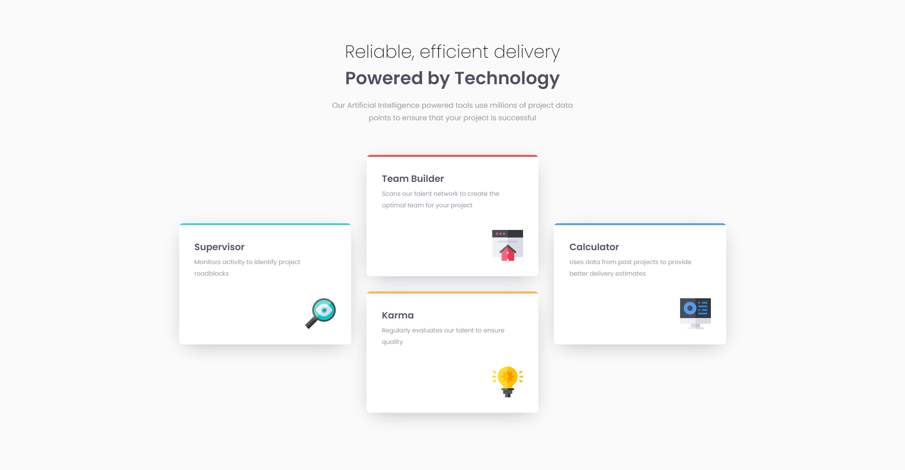

# Frontend Mentor - Four card feature section solution

This is a solution to the [Four card feature section challenge on Frontend Mentor](https://www.frontendmentor.io/challenges/four-card-feature-section-weK1eFYK). Frontend Mentor challenges help you improve your coding skills by building realistic projects. 

## Table of contents

- [Overview](#overview)
  - [The challenge](#the-challenge)
  - [Screenshot](#screenshot)
  - [Links](#links)
- [My process](#my-process)
  - [Built with](#built-with)
  - [What I learned](#what-i-learned)
  - [Useful resources](#useful-resources)
- [Author](#author)

## Overview

### The challenge

Users should be able to:

- View the optimal layout for the site depending on their device's screen size

### Screenshot



### Links

- Solution URL: [Solution](https://github.com/JustANipple/four-card-feature-section/blob/master/style.css)
- Live Site URL: [Add live site URL here](https://justanipple.github.io/four-card-feature-section/)

## My process

### Built with

- Semantic HTML5 markup
- CSS custom properties
- CSS Grid
- Mobile-first workflow
- Josh's Custom CSS Reset
- Media queries

### What I learned

I managed to display a grid to position blocks in columns and align them vertically

```css
  .gridBlock {
    display: grid;
    grid-template-areas: 
    "one two four"
    "one three four";
    max-width: 1200px;
  }
```

### Useful resources

- [Grids from MDN](https://developer.mozilla.org/en-US/docs/Learn/CSS/CSS_layout/Grids) - With this i could create template areas to create columns that can be aligned vertically

## Author

- Frontend Mentor - [@JustANipple](https://www.frontendmentor.io/profile/JustANipple)
